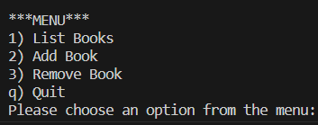
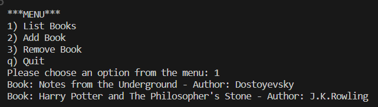
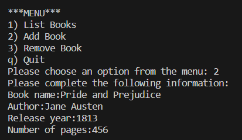
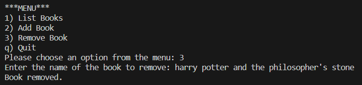
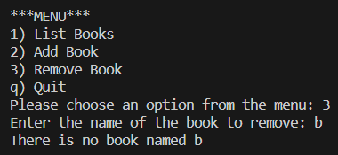
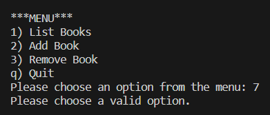
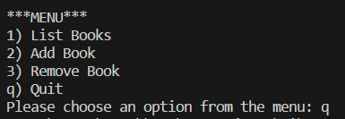

Bu proje, Global AI Hub ve Akbank iş birliğinde gerçekleştirilen Python Bootcamp kapsamında hazırlanmıştır. 
Projede, basit bir kütüphane oluşturulmuştur. Kitapların adları, yazarları, yayın tarihleri ve sayfa sayıları metin belgesi içinde tutulmuştur. Kod çalıştırıldığında kullanıcının karşısına seçeneklerin sunulduğu bir menü çıkmaktadır. Kitapları listeleme, kitap ekleme, kitap silme ve çıkış olmak üzere 4 seçenek vardır. Programın çalıştırılmasına örnek çıktı ekran görüntüleri aşağıda verilmiştir.

Program ilk çalıştırıldığında oluşan çıktı:

1.seçenek seçildiğinde tüm kitaplar listelenir:

2.seçenek seçildiğinde kullanıcıdan eklenecek olan kitabın bilgileri istenir. Tüm bilgiler girildiğinde kitap listeye eklenir:

3.seçenek seçildiğinde silinecek olan kitabın adı kullanıcıdan alınır ve kitap mevcutsa silinir, değilse uyarı verilir:

Seçeneklerden farklı bir değer girildiğinde uyarı verilir:

q seçeneği seçildiğinde program sonlandırılır. Aksi takdirde, seçilen seçenekteki işlem tamamlanınca menü kullanıcıya tekrar sunulur ve program çalışmaya devam eder.

